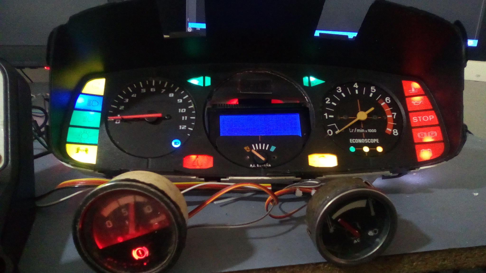
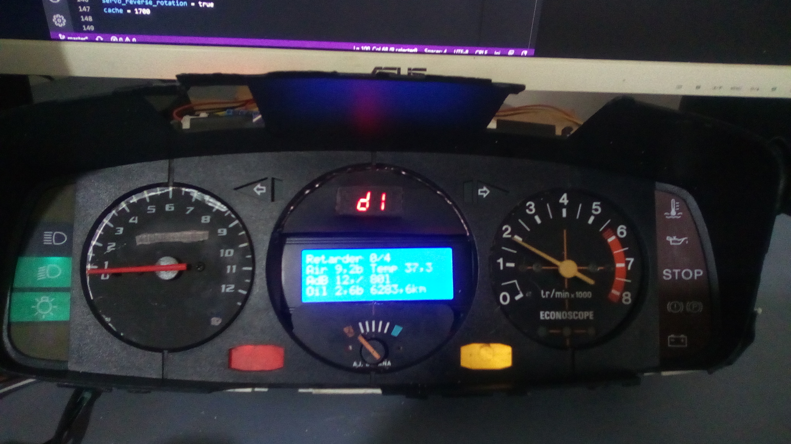

# GMTHub

WIP

This is a DIY dashboard for Euro Truck Simulator 2 and American Truck Simulator

Use [Rencloud's SDK](https://github.com/RenCloud/scs-sdk-plugin), download ETS2 plugins at [https://github.com/RenCloud/scs-sdk-plugin/releases](https://github.com/RenCloud/scs-sdk-plugin/releases)
## Features:

- speedo and tacho (frequency driven device)
- servo gauge
- LCD display with several screens
- MAX7219 display (8 digits 7 segments, dot matrix)
- led extension up to 64 leds base on MAX7219
- digital and analog output

